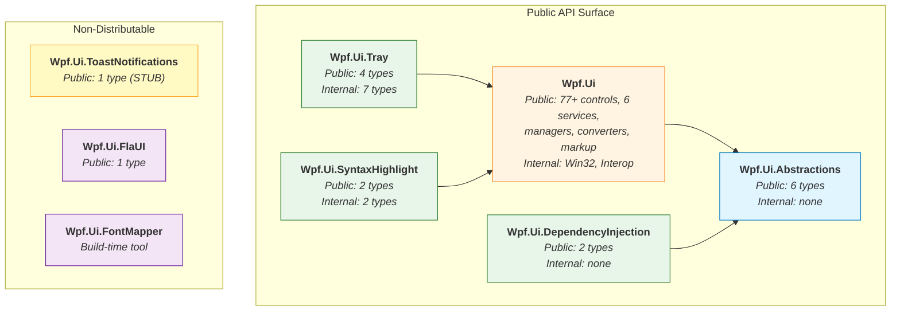

# Module Interfaces

> WPF UI v4.2.0 | Public and internal API surface per module

This document defines the public vs internal API surface for each module in the WPF UI solution. It serves as the contract specification for inter-module communication and consumer-facing APIs.

---

## Module Dependency Graph

---

## Module: Wpf.Ui.Abstractions

**NuGet:** `WPF-UI.Abstractions`
**TFMs:** `net10.0`, `net9.0`, `net8.0`, `net462`, `netstandard2.1`, `netstandard2.0`
**Dependencies:** None (zero external dependencies)

### Public Types

| Type | Kind | Description |
|------|------|-------------|
| `INavigationViewPageProvider` | Interface | Resolves page instances by type for NavigationView |
| `INavigableView<T>` | Interface | Associates a view with its ViewModel type |
| `INavigationAware` | Interface | Lifecycle callbacks for navigation (OnNavigatedTo/From) |
| `NavigationAware` | Abstract class | Base implementation of `INavigationAware` |
| `NavigationException` | Exception | Thrown when navigation operations fail |
| `NavigationViewPageProviderExtensions` | Static class | Extension methods for `INavigationViewPageProvider` |

### Internal Types

None. This module is entirely public by design -- it defines the contract surface.

---

## Module: Wpf.Ui (Core)

**NuGet:** `WPF-UI`
**TFMs:** `net10.0-windows`, `net9.0-windows`, `net8.0-windows`, `net481`, `net472`, `net462`
**Dependencies:** `Wpf.Ui.Abstractions`, `Microsoft.Windows.CsWin32` (build-time), `System.Memory`

### Public Namespaces

| Namespace | Contents |
|-----------|----------|
| `Wpf.Ui` | `UiApplication`, service interfaces and implementations |
| `Wpf.Ui.Controls` | 77+ Fluent Design controls |
| `Wpf.Ui.Appearance` | `ApplicationThemeManager`, `ApplicationAccentColorManager`, `SystemThemeWatcher`, `WindowBackgroundManager` |
| `Wpf.Ui.Converters` | 18 `IValueConverter` implementations |
| `Wpf.Ui.Markup` | `ControlsDictionary`, `ThemesDictionary`, `SymbolIconExtension`, `FontIconExtension`, `ImageIconExtension` |
| `Wpf.Ui.Extensions` | 14 extension method classes |
| `Wpf.Ui.Input` | `IRelayCommand`, `IRelayCommand<T>`, `RelayCommand<T>` |

### Public Service Interfaces

| Interface | Implementation | Wraps |
|-----------|---------------|-------|
| `INavigationService` | `NavigationService` | `INavigationView` control |
| `IContentDialogService` | `ContentDialogService` | `ContentDialog` control |
| `ISnackbarService` | `SnackbarService` | `Snackbar` control |
| `IThemeService` | `ThemeService` | `ApplicationThemeManager` (static) |
| `ITaskBarService` | `TaskBarService` | COM `ITaskbarList4` |
| `INavigationWindow` | — | Interface for windows hosting NavigationView |

### Internal / Should-Be-Internal Namespaces

| Namespace | Status | Notes |
|-----------|--------|-------|
| `Wpf.Ui.Interop` | **Currently public** | Managed Win32 wrappers (`UnsafeNativeMethods`, `PInvoke`). Recommended for internalization (see [RECOMMENDATIONS.md](RECOMMENDATIONS.md)) |
| `Wpf.Ui.Win32` | **Currently public** | OS version utilities. Recommended for internalization |

> **Note:** `Wpf.Ui.Interop` and `Wpf.Ui.Win32` expose raw P/Invoke declarations that are implementation details. Consumers should not depend on these namespaces. A future major version should mark them `internal`.

---

## Module: Wpf.Ui.DependencyInjection

**NuGet:** `WPF-UI.DependencyInjection`
**TFMs:** `net10.0`, `net9.0`, `net8.0`, `net462`, `netstandard2.1`, `netstandard2.0`
**Dependencies:** `Wpf.Ui.Abstractions`, `Microsoft.Extensions.DependencyInjection.Abstractions` 3.1.0

### Public Types

| Type | Kind | Description |
|------|------|-------------|
| `ServiceCollectionExtensions` | Static class | `AddNavigationViewPageProvider<T>()` extension method for `IServiceCollection` |
| `DependencyInjectionNavigationViewPageProvider` | Class | `INavigationViewPageProvider` implementation that resolves pages via `IServiceProvider` |

### Internal Types

None.

---

## Module: Wpf.Ui.Tray

**NuGet:** `WPF-UI.Tray`
**TFMs:** `net10.0-windows`, `net9.0-windows`, `net8.0-windows`, `net481`, `net472`, `net462`
**Dependencies:** `Wpf.Ui`, `System.Drawing.Common`

### Public Types

| Type | Kind | Description |
|------|------|-------------|
| `INotifyIconService` | Interface | Service interface for tray icon management |
| `NotifyIconService` | Class | `INotifyIconService` implementation |
| `NotifyIcon` | Control | WPF control for declarative tray icon in XAML |
| `RoutedNotifyIconEvent` | Delegate | Event delegate for tray icon interactions |

### Internal Types

| Type | Kind | Description |
|------|------|-------------|
| `INotifyIcon` | Interface | Internal abstraction for tray icon operations |
| `TrayHandler` | Class | Shell32 `Shell_NotifyIcon` P/Invoke wrapper |
| `TrayManager` | Class | Tray icon lifecycle management |
| `TrayData` | Struct | Native tray icon data structure |
| `Hicon` | Struct | Icon handle wrapper |
| `NotifyIconEventHandler` | Delegate | Internal event handler |
| `InternalNotifyIconManager` | Class | Theme-aware tray icon management |

---

## Module: Wpf.Ui.SyntaxHighlight

**NuGet:** `WPF-UI.SyntaxHighlight`
**TFMs:** `net10.0-windows`, `net9.0-windows`, `net8.0-windows`, `net481`, `net472`, `net462`
**Dependencies:** `Wpf.Ui`

### Public Types

| Type | Kind | Description |
|------|------|-------------|
| `CodeBlock` | Control | WPF control for syntax-highlighted code display |
| `SyntaxHighlightDictionary` | Markup Extension | XAML resource dictionary for syntax highlighting styles |

### Internal Types

| Type | Kind | Description |
|------|------|-------------|
| `Highlighter` | Class | Regex-based syntax highlighting engine |
| `SyntaxLanguage` | Enum | Supported language identifiers |

---

## Module: Wpf.Ui.ToastNotifications

**NuGet:** `WPF-UI.ToastNotifications`
**TFMs:** `net10.0-windows`, `net9.0-windows`, `net8.0-windows`, `net481`, `net472`, `net462`
**Dependencies:** None (standalone stub)

### Public Types

| Type | Kind | Description |
|------|------|-------------|
| `Toast` | Class | **STUB** — all methods throw `NotImplementedException` |

> **Warning:** This module is a placeholder with no implementation. See [RECOMMENDATIONS.md](RECOMMENDATIONS.md) — recommended to either implement or remove.

---

## Module: Wpf.Ui.FlaUI

**NuGet:** `WPF-UI.FlaUI`
**TFMs:** `net10.0-windows`, `net9.0-windows`, `net8.0-windows`, `net481`
**Dependencies:** `FlaUI.Core`

### Public Types

| Type | Kind | Description |
|------|------|-------------|
| `AutoSuggestBox` | Class | FlaUI automation element wrapper for `Wpf.Ui.Controls.AutoSuggestBox` |

---

## Module: Wpf.Ui.FontMapper

**Type:** Build-time console tool (not a distributable library)
**TFMs:** `net10.0`
**Dependencies:** None

### Public Types

None. This is a build tool that generates `SymbolRegular` and `SymbolFilled` enums from Fluent System Icons font JSON data. It is not referenced by other projects at runtime.

---

## Cross-Module Interface Rules

1. **Abstractions are the only shared contract.** Modules that need to communicate must do so through `Wpf.Ui.Abstractions` interfaces.
2. **Core library is the integration point.** Only `Wpf.Ui` may depend on Win32 interop and WPF framework internals.
3. **Satellite packages depend downward only.** `Tray` and `SyntaxHighlight` depend on `Core`; they never depend on each other.
4. **DI package depends on Abstractions only.** `Wpf.Ui.DependencyInjection` must never take a dependency on `Wpf.Ui` to keep it lightweight.
5. **Internal namespaces are not API surface.** Types in `Wpf.Ui.Interop` and `Wpf.Ui.Win32` are implementation details even though they are currently `public`.
