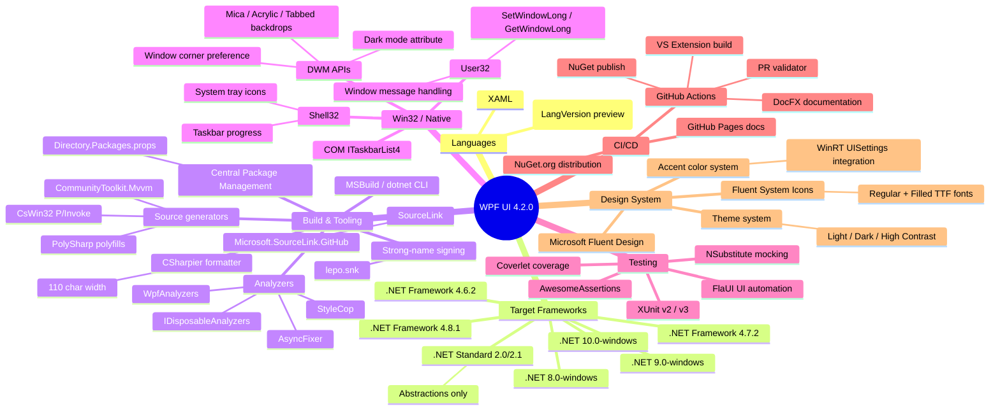

# WPF UI - Architecture Documentation

| Property | Value |
|---|---|
| **Project** | WPF UI (wpfui) |
| **Version** | 4.2.0 |
| **Type** | Open-source WPF UI control library |
| **License** | MIT |
| **Language** | C# 14 / XAML |
| **Platforms** | .NET 10/9/8 + .NET Framework 4.6.2/4.7.2/4.8.1 |

## Overview

WPF UI is an open-source library that implements the **Microsoft Fluent Design System** for Windows Presentation Foundation (WPF) applications. It provides **77+ custom controls**, a full theming system with light/dark/high-contrast modes, Win32 interop for modern window chrome effects (Mica, Acrylic, Tabbed backdrops), navigation services, and icon support through the Fluent System Icons font family.

The library enables thousands of developers to modernize legacy WPF applications with contemporary Windows 11 visual styles without migrating to WinUI 3 or MAUI.

## Table of Contents

### Architecture Views

| Document | Description |
|---|---|
| [C4 Context (Level 1)](views/context.md) | System context diagram showing WPF UI in its environment -- consumer applications, Windows OS, distribution channels |
| [Logical Architecture](views/logical-architecture.md) | Module dependencies, layer diagram, core library internal component structure, detected patterns |

### Software Design Documents (SDD)

| Document | Description |
|---|---|
| [CONSTITUTION.md](CONSTITUTION.md) | Project constitution -- coding conventions, boundary system (ALWAYS DO / ASK FIRST / NEVER DO), rules files summary |
| [IMPLEMENTATION-GUIDE.md](IMPLEMENTATION-GUIDE.md) | Step-by-step guides for common tasks -- adding controls, services, gallery pages, Win32 interop, theming, testing |
| [TESTING-SPEC.md](TESTING-SPEC.md) | Testing specification -- frameworks, templates, naming conventions, run commands |
| [MODULE-INTERFACES.md](MODULE-INTERFACES.md) | Module interface contracts -- public vs internal API surface per module, dependency rules |

### Cross-Cutting Concerns

| Document | Description |
|---|---|
| [Testing](cross-cutting/testing.md) | Test strategy, frameworks, naming conventions, coverage gaps |
| [Theming and Appearance](cross-cutting/theming-and-appearance.md) | Theme system architecture, accent colors, backdrop effects, theme change flow |
| [Win32 Interop](cross-cutting/win32-interop.md) | Three-layer interop architecture, key APIs, handle validation, WndProc patterns |
| [Navigation](cross-cutting/navigation.md) | Navigation system lifecycle, page caching strategy, DI integration, transition animations |

### Architecture Decision Records (ADRs)

| ADR | Decision |
|---|---|
| [ADR-001](decisions/ADR-001-multi-target-framework.md) | Multi-target framework strategy (net10.0 through net462) |
| [ADR-002](decisions/ADR-002-control-library-architecture.md) | WPF control library architecture with Fluent Design |
| [ADR-003](decisions/ADR-003-win32-interop-via-cswin32.md) | Win32 interop via CsWin32 source generator |
| [ADR-004](decisions/ADR-004-static-managers-for-theming.md) | Static singleton managers for theming (implicit) |
| [ADR-005](decisions/ADR-005-feature-folder-controls.md) | Feature-folder organization for controls (implicit) |

### Other

| Document | Description |
|---|---|
| [RECOMMENDATIONS.md](RECOMMENDATIONS.md) | Prioritized architectural improvement recommendations |
| [UNCERTAINTIES.md](UNCERTAINTIES.md) | Areas needing further investigation |
| [Diagrams Index](appendix/diagrams/README.md) | Index of all architecture diagrams |
| [LikeC4 Diagrams](appendix/diagrams/wpfui.c4) | Interactive C4 diagrams in LikeC4 DSL format |

## Quick Architecture Summary

WPF UI is organized as a set of layered NuGet packages built from a single solution:

- **Wpf.Ui.Abstractions** -- Zero-dependency contract interfaces (`INavigationViewPageProvider`, `INavigationAware`, `INavigableView<T>`). Targets .NET and .NET Standard 2.0/2.1 for maximum portability.
- **Wpf.Ui** -- Core library with 77+ controls, the theming engine, Win32 interop, services, converters, animations, and icon support. This is the primary NuGet package (`WPF-UI`).
- **Wpf.Ui.DependencyInjection** -- Microsoft.Extensions.DependencyInjection integration for type-based page resolution.
- **Wpf.Ui.Tray** -- System tray icon support via Shell32 P/Invoke.
- **Wpf.Ui.SyntaxHighlight** -- Syntax-highlighted code display control.
- **Wpf.Ui.ToastNotifications** -- Toast notification support (stub, not yet implemented).
- **Wpf.Ui.FlaUI** -- FlaUI automation element wrappers for integration testing.
- **Wpf.Ui.FontMapper** -- Build-time tool that generates `SymbolRegular`/`SymbolFilled` enums from Fluent System Icons font data.
- **Wpf.Ui.Gallery** -- Comprehensive demo application showcasing all controls.
- **Wpf.Ui.Extension** -- Visual Studio 2022 extension with project templates.

### Key Architectural Concerns

1. **Control Architecture** -- Folder-per-control pattern with paired `.cs` + `.xaml` files. Controls extend standard WPF base classes and implement capability interfaces (`IAppearanceControl`, `IIconControl`).
2. **Theming System** -- Runtime resource dictionary swapping managed by `ApplicationThemeManager`. Accent colors derived from system settings via WinRT `UISettings` or DWM registry.
3. **Win32 Interop** -- Three-layer architecture: CsWin32 source-generated P/Invoke, managed wrappers (`UnsafeNativeMethods`), and high-level utilities. Enables DWM backdrop effects, custom window chrome, and system theme detection.

## Technology Stack



## Repository Structure

```
wpfui/
  src/
    Wpf.Ui/                          Core library (NuGet: WPF-UI)
      Controls/                       77 control subdirectories
      Appearance/                     Theme management system
      Animations/                     Transition animations
      Converters/                     XAML value converters
      Extensions/                     Extension methods
      Hardware/                       DPI and rendering detection
      Input/                          IRelayCommand pattern
      Interop/                        Win32 managed wrappers
      Markup/                         XAML markup extensions
      Resources/                      Theme dictionaries, fonts
      Taskbar/                        Taskbar progress COM
      Win32/                          OS version utilities
    Wpf.Ui.Abstractions/             Contracts (multi-target)
    Wpf.Ui.DependencyInjection/      MS DI integration
    Wpf.Ui.Tray/                     System tray support
    Wpf.Ui.SyntaxHighlight/          Code display control
    Wpf.Ui.ToastNotifications/       Toast notifications (stub)
    Wpf.Ui.FlaUI/                    FlaUI automation helpers
    Wpf.Ui.FontMapper/               Icon enum code generator
    Wpf.Ui.Gallery/                  Demo/showcase application
    Wpf.Ui.Extension/                VS 2022 extension
  samples/
    Wpf.Ui.Demo.Simple/              Minimal no-DI sample
    Wpf.Ui.Demo.Mvvm/                Full MVVM + DI sample
    Wpf.Ui.Demo.Console/             .NET Framework 4.7.2 console sample
    Wpf.Ui.Demo.Dialogs/             ContentDialog sample
    Wpf.Ui.Demo.SetResources.Simple/ Manual resource management sample
  tests/
    Wpf.Ui.UnitTests/                XUnit unit tests
    Wpf.Ui.Gallery.IntegrationTests/ FlaUI integration tests
  docs/                              DocFX documentation site
  .github/                           CI/CD workflows, templates
```
