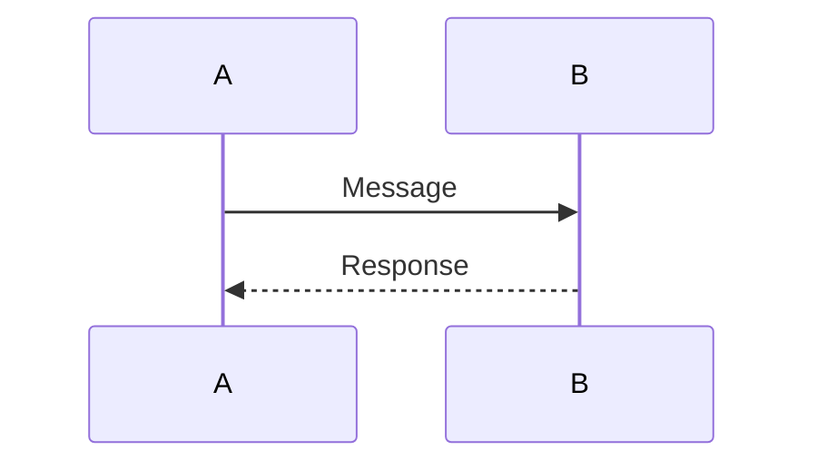
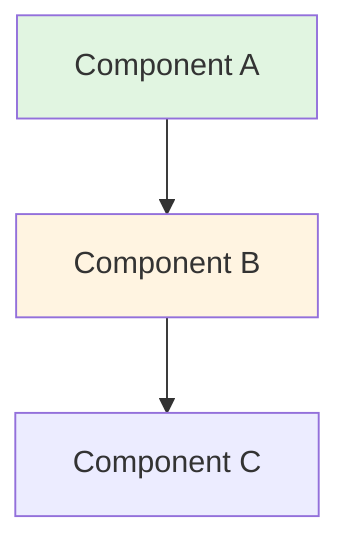
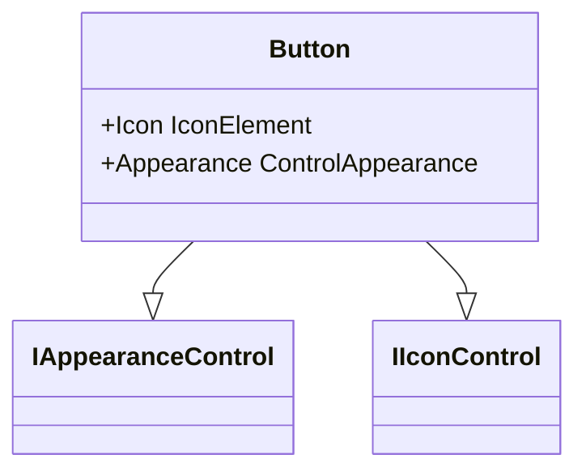

# Architecture Diagrams Index

This directory serves as an index of all architecture diagrams used throughout the WPF UI documentation.

## Architecture Views

### Context Diagram

**NuGet Package Distribution Flowchart**
- **Location:** [views/context.md](../../views/context.md#nuget-package-distribution)
- **Type:** Mermaid flowchart
- **Purpose:** Shows the NuGet package distribution flow from GitHub Actions CD through NuGet.org to developer machines
- **Key Components:** GitHub Actions CD, NuGet.org, Developer Machine

### Logical Architecture

**Module/Package Dependency Diagram**
- **Location:** [views/logical-architecture.md](../../views/logical-architecture.md#1-modulepackage-dependency-diagram)
- **Type:** Mermaid graph TD
- **Purpose:** Shows dependencies between all 10 solution projects
- **Key Components:** Abstractions, Core, DI, Tray, SyntaxHighlight, Toast, Gallery, FlaUI, FontMapper, Extension

**Core Library Internal Structure (Layer Diagram)**
- **Location:** [views/logical-architecture.md](../../views/logical-architecture.md#2-core-library-internal-structure-layer-diagram)
- **Type:** Mermaid graph TB
- **Purpose:** Six-layer architecture of the core Wpf.Ui library
- **Layers:** Controls, Appearance/Theming, Services, Infrastructure, Win32 Interop, Resources

**Control Architecture Class Diagram**
- **Location:** [views/logical-architecture.md](../../views/logical-architecture.md#3-control-architecture-pattern)
- **Type:** Mermaid classDiagram
- **Purpose:** Shows control inheritance and interface implementation patterns
- **Key Components:** WPF base classes, capability interfaces (IAppearanceControl, IIconControl), concrete controls

**Target Framework Matrix**
- **Location:** [views/logical-architecture.md](../../views/logical-architecture.md#5-target-framework-matrix)
- **Type:** Mermaid gantt chart
- **Purpose:** Visualizes TFM coverage across all modules
- **Key Components:** All solution projects with their target frameworks

**Service Registration & DI Integration**
- **Location:** [views/logical-architecture.md](../../views/logical-architecture.md#6-service-registration--di-integration)
- **Type:** Mermaid sequenceDiagram
- **Purpose:** Shows Generic Host DI registration flow and runtime page resolution
- **Key Components:** IHostBuilder, IServiceCollection, IServiceProvider, NavigationView, INavigationViewPageProvider

**Control Lifecycle State Diagram**
- **Location:** [views/logical-architecture.md](../../views/logical-architecture.md#7-control-lifecycle)
- **Type:** Mermaid stateDiagram-v2
- **Purpose:** Documents the complete lifecycle of WPF UI controls from construction through GC
- **States:** Constructed, Loaded, Template Applied, Themed, Unloaded, GC

## Cross-Cutting Concerns

### Navigation

**Navigation System Lifecycle Sequence Diagram**
- **Location:** [cross-cutting/navigation.md](../../cross-cutting/navigation.md#navigation-lifecycle)
- **Type:** Mermaid sequenceDiagram
- **Purpose:** Complete flow from NavigationService.Navigate() through page resolution, caching, INavigationAware callbacks, and transition animation
- **Key Components:** Consumer Code, NavigationService, NavigationView, INavigationViewPageProvider, Page Cache, Frame, TransitionAnimationProvider

**Page Cache Mode State Diagram**
- **Location:** [cross-cutting/navigation.md](../../cross-cutting/navigation.md#page-cache-mode)
- **Type:** Mermaid stateDiagram-v2
- **Purpose:** Illustrates the three caching strategies (Disabled, Enabled, Required) and their decision logic
- **Key States:** PageRequested, CheckCacheMode, CacheDisabled, CacheEnabled, CacheRequired, PageDisplayed

### Theming and Appearance

**Theme Change Flow Sequence Diagram**
- **Location:** [cross-cutting/theming-and-appearance.md](../../cross-cutting/theming-and-appearance.md#theme-change-flow)
- **Type:** Mermaid sequence diagram
- **Purpose:** Illustrates the complete flow of a theme change from OS event to UI update
- **Key Components:** User, App, SystemThemeWatcher, WndProc, ApplicationThemeManager, ResourceDictionaryManager, UI

**Theme System Architecture**
- **Location:** [cross-cutting/theming-and-appearance.md](../../cross-cutting/theming-and-appearance.md#architecture-components)
- **Type:** Component description with code examples
- **Purpose:** Documents the five core manager classes and their responsibilities
- **Key Components:** ApplicationThemeManager, ApplicationAccentColorManager, SystemThemeWatcher, WindowBackgroundManager, ResourceDictionaryManager

### Win32 Interop

**Win32 Interop Component Diagram**
- **Location:** [cross-cutting/win32-interop.md](../../cross-cutting/win32-interop.md#component-diagram)
- **Type:** Mermaid graph TB with subgraphs
- **Purpose:** Three-layer component diagram showing all Win32 interop participants from controls through managed wrappers to CsWin32-generated P/Invoke
- **Layers:** High-Level Utilities & Controls, Managed Wrappers (Interop/), CsWin32 Source Generation

**Three-Layer Architecture Diagram**
- **Location:** [cross-cutting/win32-interop.md](../../cross-cutting/win32-interop.md#three-layer-architecture)
- **Type:** Mermaid graph diagram
- **Purpose:** Shows the layered architecture for Win32 API access
- **Layers:**
  - Layer 1: CsWin32 Generated Code (Windows.Win32 namespace)
  - Layer 2: Managed Wrappers (UnsafeNativeMethods, Custom PInvoke)
  - Layer 3: High-Level Utilities (Win32/Utilities, Appearance Managers)

**WndProc Message Flow**
- **Location:** [cross-cutting/win32-interop.md](../../cross-cutting/win32-interop.md#wndproc-message-interception)
- **Type:** Code example with explanation
- **Purpose:** Documents window message interception pattern used by SystemThemeWatcher and TitleBar
- **Key Messages:** WM_DWMCOLORIZATIONCOLORCHANGED, WM_THEMECHANGED, WM_SYSCOLORCHANGE, WM_NCHITTEST

## Architectural Decisions

### ADR-002: Control Library Architecture

**Control Folder Structure**
- **Location:** [decisions/ADR-002-control-library-architecture.md](../../decisions/ADR-002-control-library-architecture.md#folder-per-control-structure)
- **Type:** Directory tree visualization
- **Purpose:** Shows the folder-per-control organization pattern
- **Examples:** Button/, NavigationView/, ContentDialog/

**Partial Class Decomposition**
- **Location:** [decisions/ADR-002-control-library-architecture.md](../../decisions/ADR-002-control-library-architecture.md#partial-class-decomposition)
- **Type:** Directory structure with annotations
- **Purpose:** Demonstrates how complex controls split into partial classes by concern
- **Example:** NavigationView with 6 partial files (Base, Properties, Events, Navigation, TemplateParts, AttachedProperties)

### ADR-003: Win32 Interop via CsWin32

**Handle Validation Pattern Flowchart**
- **Location:** [decisions/ADR-003-win32-interop-via-cswin32.md](../../decisions/ADR-003-win32-interop-via-cswin32.md#handle-validation-pattern)
- **Type:** Code example with step-by-step comments
- **Purpose:** Documents the mandatory three-step validation pattern for all Win32 calls
- **Steps:**
  1. Check for zero handle
  2. Verify window exists (IsWindow)
  3. Perform operation with exception handling

### ADR-005: Feature Folder Organization

**Feature Folder Patterns**
- **Location:** [decisions/ADR-005-feature-folder-controls.md](../../decisions/ADR-005-feature-folder-controls.md#structure-patterns)
- **Type:** Multiple directory tree visualizations
- **Purpose:** Shows three organization patterns: Simple controls, Complex controls with partials, Controls with related types
- **Examples:**
  - Simple: Badge/ (2 files)
  - Complex: NavigationView/ (7+ files)
  - With Related Types: NavigationView/ with NavigationViewItem, NavigationViewItemHeader, etc.

### Module Interfaces

**Module Dependency Graph (Public/Internal)**
- **Location:** [MODULE-INTERFACES.md](../../MODULE-INTERFACES.md#module-dependency-graph)
- **Type:** Mermaid graph TD with subgraphs
- **Purpose:** Shows module dependencies with public/internal type counts per module
- **Key Components:** All distributable and non-distributable modules with API surface annotations

## Data Flow Diagrams

### Theme Change Flow
**Diagram:** Sequence diagram showing theme change propagation
```
User → OS Settings → WndProc → SystemThemeWatcher → ApplicationThemeManager →
ResourceDictionaryManager → Application.Resources → UI Update
```

### Win32 Call Stack
**Diagram:** Layer diagram showing Win32 interop call flow
```
High-Level Code → UnsafeNativeMethods (validation) → PInvoke (CsWin32) → Win32 API
```

### Navigation Flow
**Diagram:** (Not yet created) Could be added to show:
```
NavigationService → NavigationView → PageProvider → Page Resolution →
Frame Navigation → INavigationAware Callbacks
```

## Component Diagrams

### Theming System Components
**Components:**
- ApplicationThemeManager (theme selection)
- ApplicationAccentColorManager (accent colors)
- SystemThemeWatcher (OS sync)
- WindowBackgroundManager (window appearance)
- ResourceDictionaryManager (resource swapping)

**Relationships:**
- SystemThemeWatcher → ApplicationThemeManager (triggers Apply)
- ApplicationThemeManager → ResourceDictionaryManager (delegates swapping)
- ApplicationAccentColorManager → ResourceDictionaryManager (updates dynamic resources)

### Control Architecture Components
**Components:**
- Control Class (.cs file)
- Implicit Style (.xaml file)
- Dependency Properties
- Routed Events
- Capability Interfaces (IAppearanceControl, IIconControl, IThemeControl)

**Relationships:**
- Control Class → Dependency Properties (registers)
- Control Class → Capability Interfaces (implements)
- XAML Style → Control Class (targets via TargetType)

## Future Diagram Additions

### Recommended Additions
1. **Content Dialog Lifecycle** - Async ShowAsync() flow with cancellation and result handling
2. **Icon System Hierarchy** - IconElement inheritance tree (FontIcon, SymbolIcon, ImageIcon)
3. **Accent Color Derivation** - How 20+ accent resources are computed from system accent
4. **Gallery App Architecture** - MVVM structure with ViewModels, Views, Services, and Models

### Recently Added (2026-02-10)
- ~~Navigation System Flow~~ — Added in [cross-cutting/navigation.md](../../cross-cutting/navigation.md)
- ~~DI Integration Flow~~ — Added in [views/logical-architecture.md](../../views/logical-architecture.md#6-service-registration--di-integration)
- ~~Service Layer Architecture~~ — Covered by DI Integration and Module Interfaces diagrams

## Diagram Guidelines

### Mermaid Syntax
All diagrams use Mermaid for easy maintenance and version control:

**Sequence Diagram:**


**Graph Diagram:**


**Class Diagram:**


### Diagram Best Practices
1. Keep diagrams focused (single concern per diagram)
2. Use consistent styling across related diagrams
3. Include legend when colors/shapes have meaning
4. Maintain diagram source in markdown (not separate image files)
5. Update diagrams when architecture changes

## Diagram Tools

### Recommended Tools
- **Mermaid Live Editor** - https://mermaid.live/
- **VS Code Extensions:**
  - Markdown Preview Mermaid Support
  - Mermaid Editor

### Generating PNG/SVG
For presentations or external documentation:
```bash
# Using mmdc (Mermaid CLI)
npm install -g @mermaid-js/mermaid-cli
mmdc -i diagram.mmd -o diagram.png
```

## Maintenance

### Ownership
Architecture diagram maintenance is part of architecture documentation updates. When making architectural changes:

1. Identify affected diagrams
2. Update diagram source in markdown
3. Verify rendering in preview
4. Update this index if adding new diagrams

### Review Checklist
- [ ] Diagram accurately reflects current architecture
- [ ] All components labeled clearly
- [ ] Relationships shown with appropriate arrows
- [ ] Color coding explained (if used)
- [ ] Renders correctly in GitHub markdown preview
- [ ] Index updated with new diagram location
