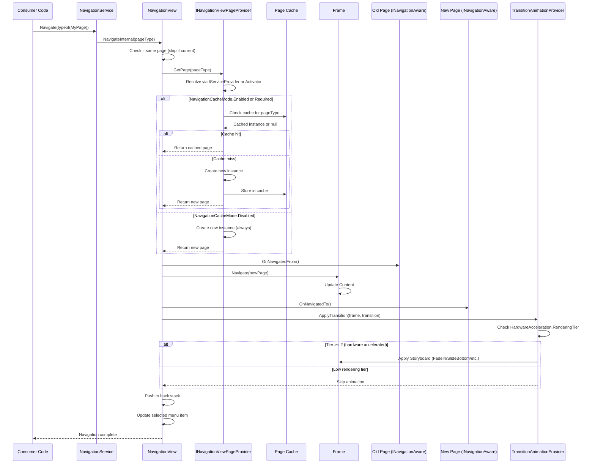
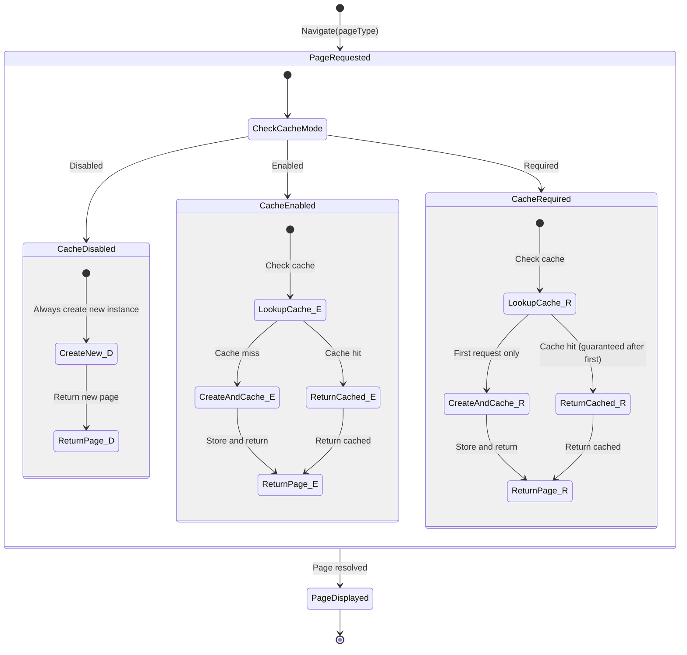

# Navigation System

> WPF UI v4.2.0 | Cross-Cutting Concern

## Overview

The WPF UI navigation system provides page-based navigation within `NavigationView`, with support for page caching, back stack management, transition animations, and lifecycle callbacks. It integrates with Microsoft.Extensions.DependencyInjection for type-based page resolution.

---

## Navigation Lifecycle

The following sequence diagram shows the complete flow from a `NavigationService.Navigate()` call through to the page being displayed with transition animations.



---

## Page Cache Mode

NavigationView supports three caching strategies via the `NavigationCacheMode` property on individual pages. The cache is maintained per-type within the `INavigationViewPageProvider` implementation.



### Cache Mode Comparison

| Mode | First Visit | Subsequent Visits | Page State | Use Case |
|------|-------------|-------------------|------------|----------|
| **Disabled** | New instance | New instance | Lost on navigate away | Forms, transient views |
| **Enabled** | New instance | Cached instance (if available) | Preserved while cached | Dashboard, lists |
| **Required** | New instance | Always cached instance | Always preserved | Settings, stateful views |

---

## Key Components

### NavigationService

Thin wrapper around `INavigationView` that provides a service-oriented API for navigation. Registered in DI as `INavigationService`.

**Key methods:**
- `Navigate(Type pageType)` — Navigate to a page by type
- `Navigate(string pageTag)` — Navigate to a page by tag
- `GoBack()` — Navigate to the previous page in the back stack
- `SetNavigationControl(INavigationView)` — Bind to a NavigationView instance

### INavigationViewPageProvider

Abstraction for page instance resolution. Two implementations:
1. **`DependencyInjectionNavigationViewPageProvider`** (from `Wpf.Ui.DependencyInjection`) — resolves pages via `IServiceProvider`
2. **Manual/custom** — consumers can implement their own provider

### INavigationAware

Lifecycle interface for pages that need to respond to navigation events:
- `OnNavigatedTo()` — Called when the page becomes the active view
- `OnNavigatedFrom()` — Called when the page is navigated away from

### Transition Animations

`TransitionAnimationProvider` applies entry animations to navigated pages. Available transitions: `FadeIn`, `FadeInFromBottom`, `SlideFromBottom`, `SlideFromRight`, `SlideFromLeft`. Animations are skipped when `HardwareAcceleration.RenderingTier < 2`.

---

## Integration with DI

For hosted applications using `Microsoft.Extensions.Hosting`:

```csharp
// In Program.cs or Startup
services.AddNavigationViewPageProvider<DependencyInjectionNavigationViewPageProvider>();
services.AddSingleton<INavigationService, NavigationService>();

// Pages registered in DI
services.AddTransient<DashboardPage>();
services.AddTransient<SettingsPage>();
```

The `DependencyInjectionNavigationViewPageProvider` resolves pages from the DI container, respecting their registered lifetime (Transient, Scoped, Singleton).

---

## Back Stack

NavigationView maintains an internal back stack of previously visited page types. The `GoBack()` operation pops the most recent entry and navigates to it. The back stack is cleared when navigating to a page that is already in the stack (cycle prevention).

## Design Considerations

- **Static vs DI navigation:** Simple apps can use `NavigationService` directly; hosted apps use DI. Both paths are supported.
- **Cache ownership:** The page cache lives in `INavigationViewPageProvider`, not in NavigationView. This allows DI-managed lifetimes to control cache behavior.
- **Animation gating:** Transition animations check rendering tier to avoid jank on software-rendered systems.
- **Thread safety:** Navigation must occur on the UI thread. `NavigationService` does not marshal calls.
