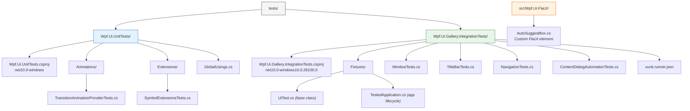

# Cross-Cutting Concern: Testing

**Project**: WPF UI (wpfui) v4.2.0
**Last Updated**: 2026-02-10

## Overview

WPF UI employs a two-tier testing strategy consisting of unit tests for isolated logic verification and integration tests for end-to-end UI automation. The testing infrastructure is intentionally lightweight, reflecting the library's nature as a visual control library where many behaviors require a running WPF application to validate.

## Test Pyramid

```
           /  Integration Tests  \        8 tests
          /  (FlaUI + Gallery App) \      End-to-end UI automation
         /________________________\
        /                          \
       /      Unit Tests            \     6 tests
      /  (XUnit + NSubstitute)       \    Isolated logic, pure functions
     /________________________________\
```

| Layer | Scope | Framework | Assertion Library | Count |
|-------|-------|-----------|-------------------|-------|
| Unit Tests | Pure logic, extension methods, animation providers | XUnit 2.9.3 + NSubstitute 5.3.0 | `Xunit.Assert` | 6 |
| Integration Tests | Window management, navigation, dialogs, title bar | XUnit v3 3.2.0 + FlaUI.UIA3 5.0.0 | AwesomeAssertions 9.3.0 | 8 |

## Test Framework Versions

All versions are managed centrally in `Directory.Packages.props`:

| Package | Version | Purpose |
|---------|---------|---------|
| `xunit` | 2.9.3 | Unit test framework (v2-style API) |
| `xunit.v3` | 3.2.0 | Integration test framework (v3 with `IAsyncLifetime`) |
| `xunit.runner.visualstudio` | 3.1.5 | Visual Studio / `dotnet test` runner |
| `Microsoft.NET.Test.Sdk` | 18.0.0 | .NET test SDK infrastructure |
| `NSubstitute` | 5.3.0 | Mocking library for unit tests |
| `AwesomeAssertions` | 9.3.0 | Fluent assertions (FluentAssertions successor) |
| `FlaUI.Core` | 5.0.0 | UI automation core library |
| `FlaUI.UIA3` | 5.0.0 | UIA3 automation adapter |
| `coverlet.collector` | 6.0.4 | Code coverage collection |

## Test Naming Conventions

### Unit Tests

Pattern: `MethodName_ExpectedResult_WhenCondition`

```csharp
[Fact]
public void ApplyTransition_ReturnsFalse_WhenDurationIsLessThan10()
```

Alternative pattern: `GivenX_Method_ExpectedResult`

```csharp
[Fact]
public void GivenAllRegularSymbols_Swap_ReturnsValidFilledSymbol()
```

### Integration Tests

Pattern: `Subject_ShouldExpectedBehavior_WhenCondition`

```csharp
[Fact]
public async Task CloseButton_ShouldCloseWindow_WhenClicked()
```

### Class Naming

- Unit test classes: `{ClassUnderTest}Tests` (e.g., `TransitionAnimationProviderTests`)
- Integration test classes: `{Feature}Tests` (e.g., `TitleBarTests`, `NavigationTests`)
- Integration test classes are `sealed`; unit test classes are not

## Test Directory Structure



## Test Infrastructure

### Unit Tests

Unit tests reference the core `Wpf.Ui` project directly and use NSubstitute for mocking WPF types (e.g., `UIElement`). Global usings are defined for common namespaces:

```
System, System.Windows, NSubstitute, Xunit
```

_Source: `tests/Wpf.Ui.UnitTests/GlobalUsings.cs`_

### Integration Tests

Integration tests use a custom infrastructure built on FlaUI:

- **`TestedApplication`** (`IAsyncLifetime`): Launches and manages the Gallery `.exe` process. Finds the executable in the test output directory. Uses `UIA3Automation` for UI element discovery.
- **`UiTest`** (abstract base class, `IAsyncLifetime`): Provides helper methods for all UI tests:
  - `FindFirst(string automationId)` -- finds UI elements by automation ID
  - `FindFirst(Func<ConditionFactory, ConditionBase>)` -- finds by condition
  - `Wait(int seconds)` -- async delay for UI settling
  - `Enter(string value)` -- simulates keyboard text input
  - `Press(VirtualKeyShort)` -- simulates a key press

### Integration Test Runner Configuration

Tests run sequentially (no parallel test collections) with invariant culture:

```json
{
  "parallelizeTestCollections": false,
  "diagnosticMessages": true,
  "culture": "invariant"
}
```

_Source: `tests/Wpf.Ui.Gallery.IntegrationTests/xunit.runner.json`_

## Run Commands

```bash
# Run unit tests
dotnet test tests/Wpf.Ui.UnitTests/Wpf.Ui.UnitTests.csproj

# Run integration tests (requires built Gallery app)
dotnet test tests/Wpf.Ui.Gallery.IntegrationTests/Wpf.Ui.Gallery.IntegrationTests.csproj

# Run all tests with coverage
dotnet test tests/Wpf.Ui.UnitTests/Wpf.Ui.UnitTests.csproj --collect:"XPlat Code Coverage"
```

## Coverage Gaps and Observations

| Area | Current Coverage | Notes |
|------|-----------------|-------|
| Animations | 2 unit tests | `TransitionAnimationProvider` edge cases only |
| Extensions | 4 unit tests | `SymbolExtensions.Swap()` and `GetString()` exhaustive enum tests |
| Controls (77+) | 0 unit tests | Controls depend on WPF runtime; consider UI automation expansion |
| Services | 0 unit tests | `INavigationService`, `IContentDialogService`, etc. are testable via mocks |
| Theming | 0 tests | Static managers (`ApplicationThemeManager`) limit testability |
| Win32 Interop | 0 tests | Requires OS-level interaction; integration tests more appropriate |
| Window Chrome | 3 integration tests | TitleBar close/minimize/maximize buttons |
| Navigation | 2 integration tests | AutoSuggestBox search and sidebar navigation |
| Dialogs | 2 integration tests | ContentDialog result text and keyboard focus isolation |
| Window | 1 integration test | Window title verification |

## CI/CD Integration

The PR validation workflow (`.github/workflows/wpf-ui-pr-validator.yaml`) currently only builds the Gallery app in Release mode. It does **not** run unit or integration tests as part of PR checks. Test execution is a local development responsibility.
