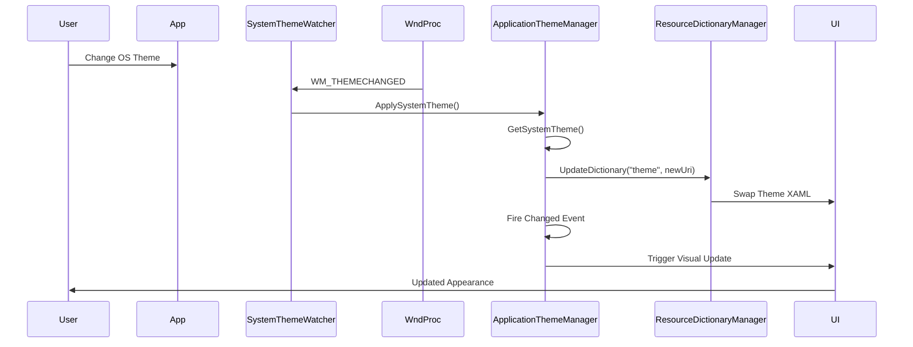

# Theming and Appearance System

## Overview

The WPF UI library implements a comprehensive theming system that supports Light, Dark, and four high-contrast themes. The system automatically synchronizes with OS theme changes, manages accent colors, and provides window backdrop effects (Mica, Acrylic, Tabbed).

## Architecture Components

### Core Manager Classes

#### ApplicationThemeManager
**Location:** `src/Wpf.Ui/Appearance/ApplicationThemeManager.cs`

Static class responsible for applying and managing application themes. Key functionality:

- **Apply(ApplicationTheme theme)** - Swaps theme resource dictionaries at runtime
- **GetAppTheme()** - Retrieves current application theme
- **Changed event** - ThemeChangedEvent delegate fires when theme changes globally

The manager uses URI-based resource dictionary swapping, searching application-level merged dictionaries for URIs containing 'wpf.ui;' and 'theme', then replacing them with the appropriate theme file.

#### ApplicationAccentColorManager
**Location:** `src/Wpf.Ui/Appearance/ApplicationAccentColorManager.cs`

Static class for accent color management:

- **Apply(Color systemAccent, ApplicationTheme theme)** - Updates 20+ dynamic color resources
- **GetColorizationColor()** - Retrieves system accent color
- **ApplySystemAccent()** - Applies Windows system accent colors

Uses WinRT IUISettings3 COM interface to retrieve system accent colors (Accent, AccentLight1-3, AccentDark1-3) with registry fallback to DWM AccentColor.

**Dynamic Resources Updated:**
- SystemAccentColor
- AccentFillColorDefault
- TextOnAccentFillColorPrimary
- AccentFillColorSecondary
- AccentFillColorTertiary
- (20+ total accent-related resources)

#### SystemThemeWatcher
**Location:** `src/Wpf.Ui/Appearance/SystemThemeWatcher.cs`

Static class providing automatic OS theme synchronization:

- **Watch(Window window)** - Hooks window to auto-sync theme with OS
- **UnWatch(Window window)** - Removes synchronization hook

Implementation uses WndProc message interception via HwndSource to listen for:
- `WM_DWMCOLORIZATIONCOLORCHANGED`
- `WM_THEMECHANGED`
- `WM_SYSCOLORCHANGE`

When detected, triggers `ApplicationThemeManager.ApplySystemTheme()`.

#### WindowBackgroundManager
**Location:** `src/Wpf.Ui/Appearance/WindowBackgroundManager.cs`

Static class for window appearance management:

- **UpdateBackground(Window? window, ApplicationTheme applicationTheme, WindowBackdropType backdrop)** - Applies dark mode and backdrop effects
- Manages WindowBackdrop effects (Mica, Acrylic, Tabbed)
- Applies DWM window attributes for Windows 11+ visual effects

#### ResourceDictionaryManager
**Location:** `src/Wpf.Ui/Appearance/ResourceDictionaryManager.cs`

Internal helper class for resource dictionary manipulation:

- Finds resource dictionaries by namespace/name matching
- Swaps resource dictionaries by URI pattern
- Handles Application.Current.Resources.MergedDictionaries traversal

## Theme Files

Six XAML resource dictionaries located in `src/Wpf.Ui/Resources/Theme/`:

1. **Light.xaml** - Light theme color scheme
2. **Dark.xaml** - Dark theme color scheme
3. **HC1.xaml** - High contrast theme variant 1
4. **HC2.xaml** - High contrast theme variant 2
5. **HCBlack.xaml** - High contrast black theme
6. **HCWhite.xaml** - High contrast white theme

### Supporting Resources

Located in `src/Wpf.Ui/Resources/` (parent directory, not the `Theme/` subdirectory):

- **Accent.xaml** - Accent color definitions
- **Palette.xaml** - Color palette system
- **StaticColors.xaml** - Static color values
- **Variables.xaml** - Theme variables

## Accent Color System

The accent color system provides dynamic, theme-aware colors derived from Windows system settings:

### Color Hierarchy
```
System Accent Color (from WinRT UISettings)
  ├── Primary Accent (direct system color)
  ├── Secondary Accent (lighter/darker variant)
  └── Tertiary Accent (additional variant)
```

### WinRT Integration
```csharp
// Retrieves colors via WinRT IUISettings3 COM interface
var uiSettings = new Windows.UI.ViewManagement.UISettings();
var accent = uiSettings.GetColorValue(UIColorType.Accent);
var accentLight1 = uiSettings.GetColorValue(UIColorType.AccentLight1);
var accentDark1 = uiSettings.GetColorValue(UIColorType.AccentDark1);
```

## WindowBackdrop Effects

Three backdrop effect types available via `WindowBackdropType` enum:

### Mica
Windows 11+ translucent backdrop with desktop wallpaper bleed-through. Applied via `DwmSetWindowAttribute` with `DWMWA_SYSTEMBACKDROP_TYPE`.

### Acrylic
Translucent acrylic material effect with blur. Requires Windows 10 Fall Creators Update or later.

### Tabbed
Windows 11 tabbed window effect grouping windows in the taskbar.

### Implementation
Effects are applied through DWM (Desktop Window Manager) APIs in `WindowBackgroundManager` and consumed by `FluentWindow` control.

## Theme Change Flow



## Usage Examples

### Basic Theme Application
```csharp
// Apply dark theme
ApplicationThemeManager.Apply(ApplicationTheme.Dark);

// Get current theme
ApplicationTheme current = ApplicationThemeManager.GetAppTheme();
```

### Automatic OS Synchronization
```csharp
public MainWindow()
{
    InitializeComponent();

    // Enable automatic theme synchronization
    Appearance.SystemThemeWatcher.Watch(this);
}
```

### Custom Accent Color
```csharp
// Apply custom accent color
Color myAccent = Color.FromRgb(0, 120, 215);
ApplicationAccentColorManager.Apply(
    myAccent,
    ApplicationTheme.Dark,
    systemGlassColor: false,
    systemAccentColor: true
);
```

### XAML Theme Selection
```xml
<Application.Resources>
    <ResourceDictionary>
        <ResourceDictionary.MergedDictionaries>
            <!-- Select theme via ThemesDictionary -->
            <ui:ThemesDictionary Theme="Dark" />
            <ui:ControlsDictionary />
        </ResourceDictionary.MergedDictionaries>
    </ResourceDictionary>
</Application.Resources>
```

## Design Considerations

### Static Singleton Pattern
The theme managers use static class design for simple, globally-accessible APIs. This pattern trades testability for API simplicity and ensures single-instance theme state across the application.

### Runtime Resource Swapping
Theme changes occur via runtime resource dictionary replacement rather than restart-required configuration. This enables live theme switching without application restart.

### OS Integration
Deep integration with Windows theme system via WndProc message hooks and WinRT UISettings ensures automatic synchronization with user preferences.

### Multi-Version Support
Theme system gracefully degrades on older Windows versions, falling back to registry-based accent color detection when WinRT APIs are unavailable.
