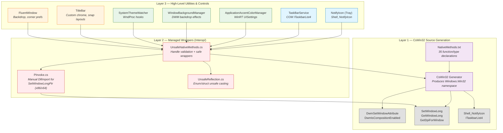
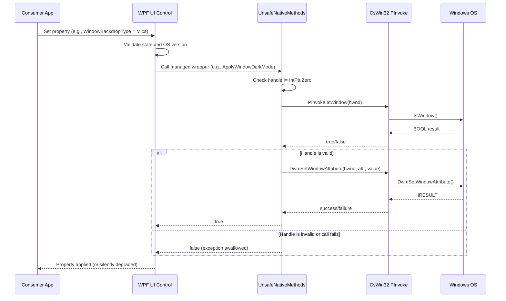

# Win32 Interop Architecture

> WPF UI v4.2.0 | Cross-Cutting Concern

## Overview

WPF UI relies heavily on Win32 interop to deliver Fluent Design features that are not natively available through the WPF framework. This includes DWM backdrop effects (Mica, Acrylic, Tabbed), dark mode title bars, window corner preferences, snap layout support, system tray icons, and taskbar progress indicators.

The interop layer follows a strict three-layer architecture that isolates raw platform calls from the rest of the library.

---

## Component Diagram



---

## Three-Layer Architecture

### Layer 1: CsWin32 Source Generation

The project uses Microsoft's [CsWin32](https://github.com/microsoft/CsWin32) source generator to produce type-safe P/Invoke bindings at compile time.

- **Configuration**: `NativeMethods.txt` lists the Win32 functions and types needed by the library.
- **Generated namespace**: `Windows.Win32`
- **Foundation types**: `HWND`, `HRESULT`, `BOOL` from `Windows.Win32.Foundation`

**Key generated functions:**

| Function | Purpose |
|----------|---------|
| `DwmSetWindowAttribute` | Apply backdrop effects, dark mode, corner preferences |
| `DwmIsCompositionEnabled` | Check if DWM composition is active |
| `SetWindowLong` / `GetWindowLong` | Manipulate window styles (32-bit) |
| `Shell_NotifyIcon` | System tray icon management |
| `ITaskbarList4` | Taskbar progress overlay (COM interface) |

### Layer 2: Managed Wrappers (`src/Wpf.Ui/Interop/`)

Managed wrappers provide validated, exception-safe access to native APIs.

#### `UnsafeNativeMethods.cs` -- Handle-Validated Wrappers

Every method follows a defensive pattern:

1. Check that the handle is not `IntPtr.Zero`
2. Verify the handle via `PInvoke.IsWindow()`
3. Call the native API
4. Catch any exception and return `false` or `null`

This pattern ensures that callers never receive unmanaged exceptions and that invalid window handles are rejected before reaching the OS.

#### `UnsafeReflection.cs` -- Unsafe Enum/Struct Casting

Provides unsafe casting between managed enums/structs and their Win32 equivalents. Used where direct marshalling is insufficient or where performance-critical paths avoid boxing.

#### `PInvoke.cs` -- Custom P/Invoke Declarations

Contains hand-written P/Invoke declarations for functions that CsWin32 does not generate or generates with incompatible signatures. Example: `SetWindowLongPtrW` requires platform-specific handling (different entry points on 32-bit vs 64-bit Windows).

### Layer 3: Utilities (`src/Wpf.Ui/Win32/`)

#### `Utilities.cs` -- OS Version Detection

Provides high-level queries about the running environment:

| Property | Logic |
|----------|-------|
| `IsOSWindows11OrNewer` | OS build number >= 22000 |
| `IsCompositionEnabled` | Calls `DwmIsCompositionEnabled` |

These checks gate feature availability so that controls degrade gracefully on older Windows versions.

---

## API Surface by Windows Component

| API | Usage | Key Functions |
|-----|-------|---------------|
| **DWM** | Backdrop effects (Mica/Acrylic/Tabbed), dark mode, corner preferences | `DwmSetWindowAttribute`, `DwmIsCompositionEnabled` |
| **User32** | Window style manipulation, message pump interception, snap layouts | `SetWindowLong`, `GetWindowLong`, `SetWindowLongPtr` |
| **Shell32** | System tray icons, taskbar progress | `Shell_NotifyIcon`, `ITaskbarList4` COM |
| **WinRT UISettings** | System accent colors (8-color palette) | `IUISettings3` COM interface |
| **Registry** | Fallback for accent colors, OS version detection | `DWM\AccentColor`, `CurrentVersion` |
| **WndProc** | Theme change detection, title bar hit testing | `WM_THEMECHANGED`, `WM_DWMCOLORIZATIONCOLORCHANGED`, `WM_NCHITTEST` |

---

## Interop Call Flow

The following diagram illustrates the typical call path from a consumer application through the interop layers to the Windows OS.



---

## Error Handling Pattern

The Win32 interop layer follows a deliberate error-swallowing strategy:

1. **Bare catch blocks are intentional.** Win32 APIs may fail unpredictably across OS versions, and there is no reliable way to enumerate all failure modes at compile time. Swallowing exceptions ensures the application continues to function, albeit without the requested visual effect.

2. **Graceful degradation is the design goal.** If a Mica backdrop cannot be applied (e.g., on Windows 10), the window falls back to a solid background. No exception propagates to the consumer.

3. **Handle validation is mandatory.** Every wrapper method must validate that the `HWND` is non-zero and represents a valid window before calling any native API. This prevents access violations from stale or recycled handles.

4. **Return values signal success.** Methods return `bool` (success/failure) or nullable types rather than throwing. Callers check return values to determine whether the native operation succeeded.

```
Pattern:
  if (handle == IntPtr.Zero) return false;
  if (!PInvoke.IsWindow(handle)) return false;
  try {
      NativeCall(handle, ...);
      return true;
  } catch {
      return false;
  }
```

---

## Platform Considerations

- **32-bit vs 64-bit**: `SetWindowLongPtr` does not exist as a distinct entry point on 32-bit Windows. The custom `PInvoke.cs` handles this by routing to `SetWindowLong` on x86 and `SetWindowLongPtrW` on x64.
- **Windows 10 vs 11**: Many DWM attributes (e.g., `DWMWA_SYSTEMBACKDROP_TYPE`) are only available on Windows 11 (build 22000+). The `Utilities` class gates these calls.
- **COM activation**: `ITaskbarList4` and `IUISettings3` require COM activation. These are wrapped to handle `COMException` gracefully.
