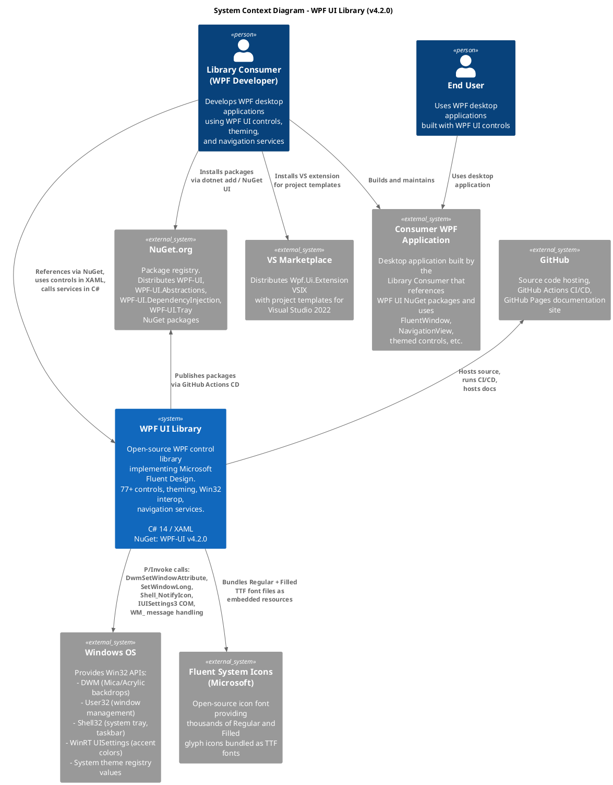
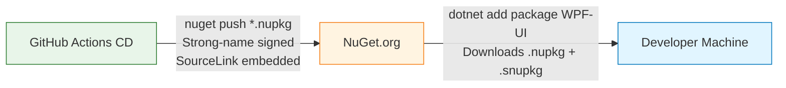

# C4 Context Diagram (Level 1)

This document describes the system context of WPF UI -- the external actors, systems, and data flows that surround the library.

## Context Diagram



## External Actors

### Library Consumers (WPF Developers)

The primary users of WPF UI are C#/WPF developers who want to apply Microsoft Fluent Design System styling to their desktop applications. They interact with the library by:

1. **Installing NuGet packages** -- `WPF-UI` (core), optionally `WPF-UI.DependencyInjection`, `WPF-UI.Tray`, `WPF-UI.Abstractions`
2. **Adding XAML resource dictionaries** -- `<ui:ControlsDictionary/>` and `<ui:ThemesDictionary Theme="Dark"/>` in `App.xaml`
3. **Using controls in XAML** -- Via the `xmlns:ui="http://schemas.lepo.co/wpfui/2022/xaml"` namespace prefix
4. **Calling services in C#** -- `INavigationService`, `IContentDialogService`, `ISnackbarService`, `ApplicationThemeManager`

### End Users

End users interact with consumer WPF applications built using WPF UI. They experience Fluent Design visuals (rounded corners, Mica backdrop, accent colors) and interact with the 77+ controls. End users do not directly interact with the WPF UI library.

### Windows OS

WPF UI makes extensive use of the Windows platform through several channels:

| API Surface | Usage | Key Functions |
|---|---|---|
| **DWM (Desktop Window Manager)** | Backdrop effects (Mica, Acrylic, Tabbed), dark mode, window corner preferences | `DwmSetWindowAttribute`, `DwmIsCompositionEnabled` |
| **User32** | Window style manipulation, message pump interception, snap layouts | `SetWindowLong`, `GetWindowLong`, `SetWindowLongPtr` |
| **Shell32** | System tray icons, taskbar progress | `Shell_NotifyIcon`, `ITaskbarList4` COM |
| **WinRT UISettings** | System accent colors (8-color palette) | `IUISettings3` COM interface |
| **Registry** | Fallback for accent colors, OS version detection | `DWM\AccentColor`, `CurrentVersion` |
| **WndProc Messages** | Theme change detection, title bar hit testing | `WM_THEMECHANGED`, `WM_DWMCOLORIZATIONCOLORCHANGED`, `WM_NCHITTEST` |

### NuGet.org

The primary distribution channel for WPF UI. The GitHub Actions CD pipeline (`wpf-ui-cd-nuget.yaml`) publishes the following packages on every version bump (triggered by `Directory.Build.props` changes on the `main` branch):

| Package ID | Project | Description |
|---|---|---|
| `WPF-UI` | `Wpf.Ui` | Core library with controls, theming, services |
| `WPF-UI.Abstractions` | `Wpf.Ui.Abstractions` | Interface contracts for navigation |
| `WPF-UI.DependencyInjection` | `Wpf.Ui.DependencyInjection` | MS DI integration |
| `WPF-UI.Tray` | `Wpf.Ui.Tray` | System tray icon support |

### Visual Studio Marketplace

Distributes the `Wpf.Ui.Extension` VSIX for Visual Studio 2022 (x64 and arm64). Built by the `wpf-ui-cd-extension.yaml` workflow. Provides project templates for creating new WPF UI applications.

### GitHub

Hosts the source repository, runs CI/CD via GitHub Actions (7 workflows), and serves the DocFX documentation site via GitHub Pages.

## Data Flows

### NuGet Package Distribution



### Win32 API Calls (Runtime)

```
Consumer WPF App
     |
     |  Uses FluentWindow / TitleBar / SystemThemeWatcher
     |
     v
  Wpf.Ui Core Library
     |
     |-- UnsafeNativeMethods (handle validation layer)
     |      |
     |      |-- CsWin32 PInvoke (source-generated declarations)
     |             |
     |             v
     |      Windows.Win32 namespace
     |
     v
  Windows OS Kernel / DWM / Shell32 / User32
```

### XAML Resource Loading

```
Consumer App.xaml
     |
     |  <ui:ThemesDictionary Theme="Dark"/>
     |  <ui:ControlsDictionary/>
     |
     v
  ThemesDictionary (Markup Extension)
     |  Resolves pack URI:
     |  pack://application:,,,/Wpf.Ui;component/Resources/Theme/Dark.xaml
     |
     v
  ControlsDictionary (Markup Extension)
     |  Resolves pack URI:
     |  pack://application:,,,/Wpf.Ui;component/Resources/Wpf.Ui.xaml
     |     --> Merges all 77 control .xaml ResourceDictionaries
     |     --> Loads font resources (FluentSystemIcons)
     |     --> Loads palette, typography, variables
     |
     v
  WPF Resource System
     |  Controls resolve styles via DefaultStyleKeyProperty
     |  Theme brushes resolved via DynamicResource
     |  Accent colors updated programmatically by ApplicationAccentColorManager
```

### Theme Change Flow

```
Windows OS
     |
     |  WM_DWMCOLORIZATIONCOLORCHANGED
     |  WM_THEMECHANGED
     |  WM_SYSCOLORCHANGE
     |
     v
  SystemThemeWatcher (HwndSource.AddHook)
     |
     |  Detects OS theme change
     |
     v
  ApplicationThemeManager.ApplySystemTheme()
     |
     |-- ResourceDictionaryManager.UpdateDictionary("theme", newThemeUri)
     |      Swaps Light.xaml <-> Dark.xaml in MergedDictionaries
     |
     |-- ApplicationAccentColorManager.Apply(accentColor, theme)
     |      Updates 20+ dynamic color resources
     |
     |-- WindowBackgroundManager.UpdateBackground(window)
     |      Applies DWM dark mode attribute + backdrop effect
     |
     |-- Fires ApplicationThemeManager.Changed event
     |      --> Subscribers (CodeBlock, InternalNotifyIconManager, consumer code)
```
