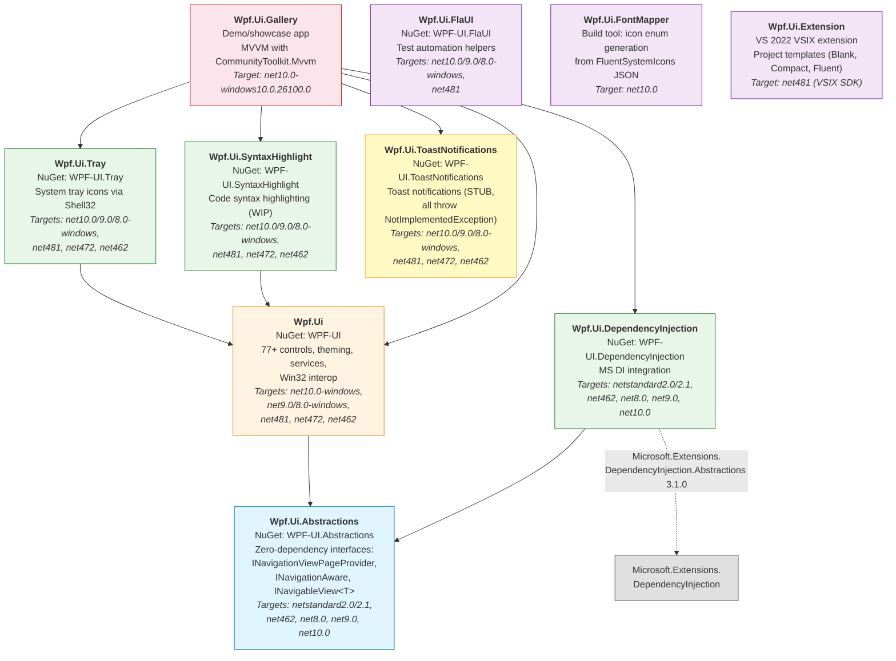
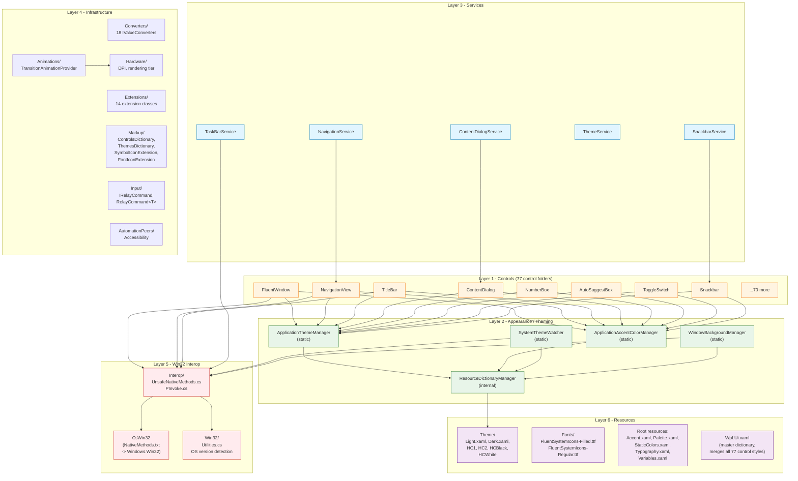
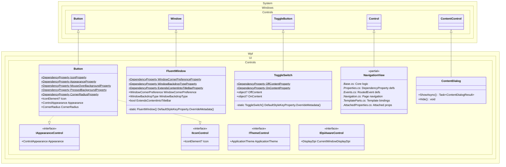
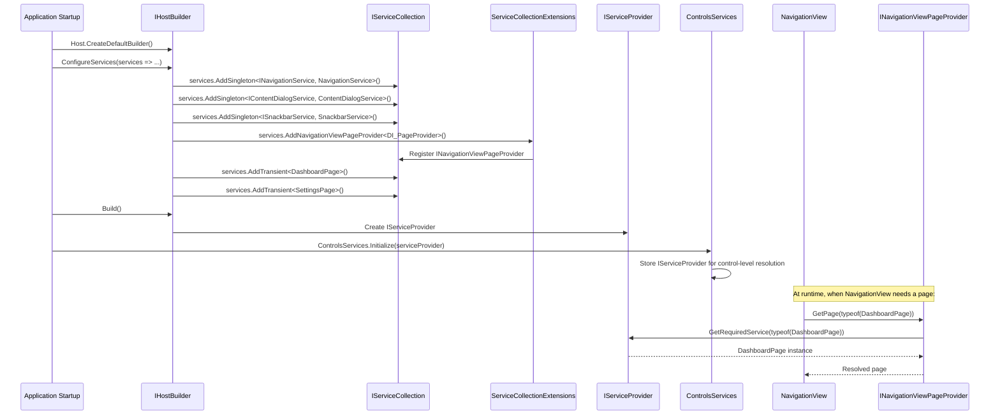
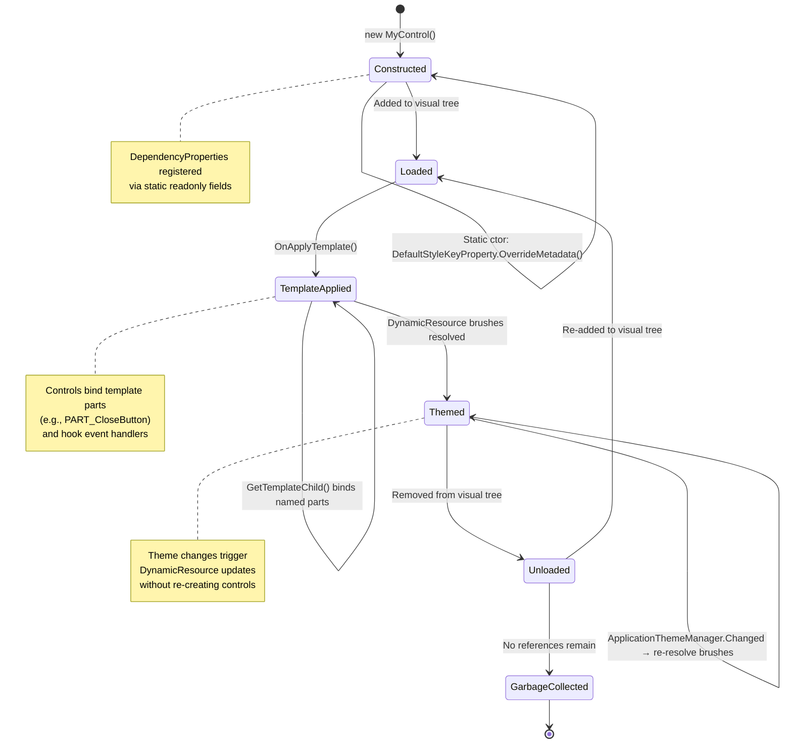

# Logical Architecture

This document describes the logical architecture of WPF UI v4.2.0, a C# WPF control library implementing Microsoft Fluent Design System. It covers module dependencies, internal layer organization, control authoring patterns, cross-cutting concerns, and the multi-targeting strategy.

---

## 1. Module/Package Dependency Diagram

The WPF UI solution consists of ten projects organized around a core library (`Wpf.Ui`) with satellite packages for optional functionality.



**Dependency rules:**

| Package | Direct dependencies |
|---------|-------------------|
| `Wpf.Ui.Abstractions` | None (zero external dependencies) |
| `Wpf.Ui` | `Wpf.Ui.Abstractions`, Microsoft.Windows.CsWin32 (build-time), System.Memory |
| `Wpf.Ui.DependencyInjection` | `Wpf.Ui.Abstractions`, Microsoft.Extensions.DependencyInjection.Abstractions 3.1.0 |
| `Wpf.Ui.Tray` | `Wpf.Ui`, System.Drawing.Common |
| `Wpf.Ui.SyntaxHighlight` | `Wpf.Ui` |
| `Wpf.Ui.ToastNotifications` | None (standalone stub) |
| `Wpf.Ui.Gallery` | `Wpf.Ui`, `Wpf.Ui.DependencyInjection`, `Wpf.Ui.Tray`, `Wpf.Ui.SyntaxHighlight`, `Wpf.Ui.ToastNotifications`, CommunityToolkit.Mvvm, Microsoft.Extensions.Hosting |
| `Wpf.Ui.FlaUI` | FlaUI.Core |
| `Wpf.Ui.FontMapper` | None |
| `Wpf.Ui.Extension` | VSIX SDK (VS 2022), template projects (Blank, Compact, Fluent) |

---

## 2. Core Library Internal Structure (Layer Diagram)

The `src/Wpf.Ui/` project is organized into six logical layers, from user-facing controls down to Win32 primitives.



### Layer Details

#### Layer 1 -- Controls (77 control folders)

Each control follows a folder-per-control pattern: `Controls/{Name}/{Name}.cs` + `Controls/{Name}/{Name}.xaml`.

Controls extend WPF base classes (`ContentControl`, `Control`, `Button`, `ToggleButton`, `Window`, etc.) and optionally implement WPF UI interfaces: `IAppearanceControl` (accent/appearance support), `IIconControl` (icon support), `IThemeControl` (theme awareness), `IDpiAwareControl` (DPI awareness).

Complex controls are split into partial classes by concern. For example, `NavigationView` spans six partial files:

| File | Responsibility |
|------|---------------|
| `NavigationView.Base.cs` | Core logic, constructor, static constructor |
| `NavigationView.Properties.cs` | DependencyProperty registrations |
| `NavigationView.Events.cs` | RoutedEvent registrations |
| `NavigationView.Navigation.cs` | Page navigation logic |
| `NavigationView.TemplateParts.cs` | Template part bindings (OnApplyTemplate) |
| `NavigationView.AttachedProperties.cs` | Attached property definitions |

Key controls: `FluentWindow`, `NavigationView`, `TitleBar`, `ContentDialog`, `NumberBox`, `AutoSuggestBox`, `ToggleSwitch`, `Snackbar`, `BreadcrumbBar`, `InfoBar`, `RatingControl`, `ProgressRing`.

#### Layer 2 -- Appearance/Theming

| Class | Pattern | Responsibility |
|-------|---------|---------------|
| `ApplicationThemeManager` | Static | Runtime theme switching via ResourceDictionary swap. Fires `ThemeChangedEvent`. |
| `ApplicationAccentColorManager` | Static | Updates 20+ dynamic color resources (SystemAccentColor, AccentFillColorDefault, etc.) from WinRT UISettings or registry fallback. |
| `SystemThemeWatcher` | Static | Hooks WndProc for `WM_THEMECHANGED`, `WM_DWMCOLORIZATIONCOLORCHANGED`, `WM_SYSCOLORCHANGE`. Auto-syncs app theme with OS. |
| `WindowBackgroundManager` | Static | Applies DWM backdrop effects (Mica, Acrylic, Tabbed) via `DwmSetWindowAttribute`. |
| `ResourceDictionaryManager` | Internal | URI-based dictionary search and swap within `Application.Resources.MergedDictionaries`. |

Six theme files: `Light.xaml`, `Dark.xaml`, `HC1.xaml`, `HC2.xaml`, `HCBlack.xaml`, `HCWhite.xaml`.

#### Layer 3 -- Services

Service implementations are defined at the `src/Wpf.Ui/` root level alongside their interface files.

| Service | Interface | Wraps |
|---------|-----------|-------|
| `NavigationService` | `INavigationService` | `INavigationView` control |
| `ContentDialogService` | `IContentDialogService` | `ContentDialog` control |
| `SnackbarService` | `ISnackbarService` | `Snackbar` control |
| `ThemeService` | `IThemeService` | `ApplicationThemeManager` static class |
| `TaskBarService` | `ITaskBarService` | COM `ITaskbarList4` via Win32 interop |

#### Layer 4 -- Infrastructure

| Component | Contents |
|-----------|----------|
| **Converters/** | 18 `IValueConverter` implementations: `BoolToVisibilityConverter`, `BrushToColorConverter`, `EnumToBoolConverter`, `IconSourceElementConverter`, `CornerRadiusSplitConverter`, `ProgressThicknessConverter`, etc. |
| **Extensions/** | 14 extension method classes: `ColorExtensions`, `FrameExtensions`, `NavigationServiceExtensions`, `SnackbarServiceExtensions`, `SymbolExtensions`, `UiElementExtensions`, etc. |
| **Markup/** | XAML markup extensions: `ControlsDictionary`, `ThemesDictionary`, `SymbolIconExtension`, `FontIconExtension`, `ImageIconExtension`, `ThemeResourceExtension`, `Design`. |
| **Animations/** | `TransitionAnimationProvider` (applies `FadeIn`, `SlideBottom`, `SlideRight`, etc.), `Transition` enum, `AnimationProperties`. Checks `HardwareAcceleration.RenderingTier` before animating. |
| **Input/** | `IRelayCommand`, `IRelayCommand<T>`, `RelayCommand<T>` -- lightweight command implementations. |
| **Hardware/** | `DpiHelper`, `DisplayDpi`, `HardwareAcceleration`, `RenderingTier` -- DPI detection and rendering tier evaluation. |
| **AutomationPeers/** | `CardControlAutomationPeer`, `ContentDialogAutomationPeer`. Controls with automation peers override `OnCreateAutomationPeer()`. |
| **Taskbar/** | `TaskbarProgress`, `TaskbarProgressState` -- Windows taskbar progress bar manipulation. |

#### Layer 5 -- Win32 Interop

A three-layer architecture for native Windows API access:

1. **CsWin32 auto-generation** (`NativeMethods.txt` lists 35 Win32 functions/types). The `Microsoft.Windows.CsWin32` source generator produces P/Invoke signatures in the `Windows.Win32` namespace. Covers DWM (DwmSetWindowAttribute, DwmIsCompositionEnabled), User32 (SetWindowLong, GetDpiForWindow, GetForegroundWindow), Shell32 (ITaskbarList4), and associated structs/enums.

2. **Managed wrappers** (`Interop/`):
   - `UnsafeNativeMethods.cs` -- safe wrappers with handle validation (`IntPtr.Zero` check + `PInvoke.IsWindow`) before calling CsWin32-generated methods. Methods like `ApplyWindowCornerPreference`, `ApplyBorderColor`, `RemoveWindowTitlebarContents`.
   - `PInvoke.cs` -- manual `[DllImport]` for `SetWindowLongPtr` (not generated by CsWin32 for all overloads).
   - `UnsafeReflection.cs` -- type casting helpers for enum-to-Win32-struct conversion.

3. **OS utilities** (`Win32/`):
   - `Utilities.cs` -- OS version detection (Vista, Windows 7, 8, 10, 11 build checks), DWM composition availability, system theme detection via `IUISettings3` COM interface.

#### Layer 6 -- Resources

| Path | Contents |
|------|----------|
| `Resources/Theme/` | 6 XAML theme dictionaries (Light, Dark, HC1, HC2, HCBlack, HCWhite) |
| `Resources/Fonts/` | `FluentSystemIcons-Filled.ttf`, `FluentSystemIcons-Regular.ttf` (embedded resources) |
| `Resources/Accent.xaml` | Dynamic accent color resources |
| `Resources/Palette.xaml` | Fluent Design color palette |
| `Resources/StaticColors.xaml` | Non-theme-dependent color constants |
| `Resources/Typography.xaml` | Font family, size, and weight resources |
| `Resources/Variables.xaml` | Corner radius, spacing, sizing tokens |
| `Resources/Wpf.Ui.xaml` | Master ResourceDictionary that merges all 77+ control style dictionaries |
| `Resources/DefaultContextMenu.xaml` | Styled context menu for TextBox-like controls |
| `Resources/DefaultFocusVisualStyle.xaml` | Fluent focus visual style |

---

## 3. Control Architecture Pattern

The following class diagram shows how WPF UI controls extend WPF base classes, implement marker interfaces, and register DependencyProperties.



### Control Authoring Recipe

Every WPF UI control follows a consistent authoring pattern:

**1. C# class file** (`Controls/{Name}/{Name}.cs`):

```csharp
// All controls use the flat namespace Wpf.Ui.Controls
// regardless of their folder location (ReSharper CheckNamespace suppressed)
namespace Wpf.Ui.Controls;

public class MyControl : System.Windows.Controls.ContentControl, IAppearanceControl, IIconControl
{
    // DependencyProperty registration via static readonly fields
    public static readonly DependencyProperty IconProperty = DependencyProperty.Register(
        nameof(Icon), typeof(IconElement), typeof(MyControl),
        new PropertyMetadata(null, null, IconElement.Coerce));

    // CLR property wrapper with [Bindable] and [Category] attributes
    [Bindable(true)]
    [Category("Appearance")]
    public IconElement? Icon
    {
        get => (IconElement?)GetValue(IconProperty);
        set => SetValue(IconProperty, value);
    }

    // Static constructor: override DefaultStyleKey for implicit style resolution
    static MyControl()
    {
        DefaultStyleKeyProperty.OverrideMetadata(
            typeof(MyControl),
            new FrameworkPropertyMetadata(typeof(MyControl)));
    }
}
```

**2. XAML style file** (`Controls/{Name}/{Name}.xaml`):

```xml
<ResourceDictionary ...>
    <Style TargetType="{x:Type controls:MyControl}">
        <Setter Property="SnapsToDevicePixels" Value="True" />
        <Setter Property="OverridesDefaultStyle" Value="True" />
        <Setter Property="Background" Value="{DynamicResource ControlFillColorDefaultBrush}" />
        <!-- DynamicResource for all theme-dependent brushes -->
        <Setter Property="Template">
            <Setter.Value>
                <ControlTemplate TargetType="{x:Type controls:MyControl}">
                    <!-- Template definition -->
                </ControlTemplate>
            </Setter.Value>
        </Setter>
    </Style>
</ResourceDictionary>
```

**3. Registration in master dictionary** (`Resources/Wpf.Ui.xaml`):

```xml
<ResourceDictionary.MergedDictionaries>
    <!-- ...other controls... -->
    <ResourceDictionary Source="pack://application:,,,/Wpf.Ui;component/Controls/MyControl/MyControl.xaml" />
</ResourceDictionary.MergedDictionaries>
```

### Key invariants:

- `OverridesDefaultStyle="True"` and `SnapsToDevicePixels="True"` are set on every control style.
- Theme-dependent brushes always use `DynamicResource` (not `StaticResource`) so they update when themes switch at runtime.
- The static constructor calling `DefaultStyleKeyProperty.OverrideMetadata` ensures WPF resolves the implicit style from the control's assembly rather than the application.
- Complex controls split into partial classes by concern (properties, events, navigation logic, template parts).

---

## 4. Key Cross-Cutting Patterns

### Flat Namespace

All controls reside in the single namespace `Wpf.Ui.Controls` despite being organized into individual subfolders under `Controls/`. This is enforced via `// ReSharper disable once CheckNamespace` pragmas in each file. The project does not suppress IDE0130 (namespace does not match folder structure) at the project level; instead, the ReSharper-specific pragma handles it.

**Rationale**: Consumers use a single `xmlns:ui="http://schemas.lepo.co/wpfui/2022/xaml"` namespace in XAML. A flat C# namespace mirrors the flat XAML namespace.

### Static Singleton Managers for Theming

The four core theming classes (`ApplicationThemeManager`, `ApplicationAccentColorManager`, `SystemThemeWatcher`, `WindowBackgroundManager`) are all `static` classes. They operate on `Application.Current.Resources` directly.

**Trade-off**: This sacrifices testability and multi-window isolation in favor of a simple, discoverable API. Consumers call `ApplicationThemeManager.Apply(ApplicationTheme.Dark)` without needing DI or service resolution. The `ThemeService` wraps these statics behind `IThemeService` for consumers who prefer DI.

### CommunityToolkit.Mvvm in Gallery and Samples

The Gallery demo app and sample applications use CommunityToolkit.Mvvm source generators:

- `[ObservableProperty]` for bindable properties
- `[RelayCommand]` for ICommand implementations
- ViewModels extend `ObservableObject` and implement `INavigationAware`
- Pages implement `INavigableView<TViewModel>` for view-model association

This is a consumption pattern only; the core `Wpf.Ui` library has no dependency on CommunityToolkit.Mvvm.

### Central Package Management

All NuGet package versions are declared in `Directory.Packages.props` at the repository root. Individual `.csproj` files reference packages without version numbers. This ensures consistent versions across all projects in the solution.

### Service Interface Inversion

Service interfaces (`INavigationService`, `IContentDialogService`, etc.) are defined at the `Wpf.Ui` assembly root level, alongside their implementations. This allows:

1. Direct instantiation for simple apps: `var service = new NavigationService();`
2. DI registration for hosted apps: `services.AddSingleton<INavigationService, NavigationService>();`
3. The `ControlsServices.Initialize(IServiceProvider)` static method enables control-level service resolution.

### Async Dialog Pattern

`ContentDialog.ShowAsync()` returns `Task<ContentDialogResult>` using `TaskCompletionSource` to bridge the WPF event model to async/await. Supports `CancellationToken` and closing cancellation via `ContentDialogClosingEventArgs.Cancel = true`.

### Win32 Interop Layering

Native Windows API calls follow a strict three-layer pipeline:

```
NativeMethods.txt  -->  CsWin32 source generator  -->  Windows.Win32 namespace (auto-generated)
                                                              |
                                                    Interop/UnsafeNativeMethods.cs (handle validation)
                                                              |
                                                    Win32/Utilities.cs (OS version guards)
```

Manual `[DllImport]` in `Interop/PInvoke.cs` supplements CsWin32 for signatures it cannot generate (e.g., `SetWindowLongPtr` with `nint` parameters).

---

## 5. Target Framework Matrix

```mermaid
gantt
    title Target Framework Coverage by Module
    dateFormat X
    axisFormat %s

    section Wpf.Ui.Abstractions
    netstandard2.0   :a1, 0, 1
    netstandard2.1   :a2, 1, 2
    net462           :a3, 2, 3
    net8.0           :a4, 3, 4
    net9.0           :a5, 4, 5
    net10.0          :a6, 5, 6

    section Wpf.Ui
    net462           :b1, 0, 1
    net472           :b2, 1, 2
    net481           :b3, 2, 3
    net8.0-windows   :b4, 3, 4
    net9.0-windows   :b5, 4, 5
    net10.0-windows  :b6, 5, 6

    section Wpf.Ui.DependencyInjection
    netstandard2.0   :c1, 0, 1
    netstandard2.1   :c2, 1, 2
    net462           :c3, 2, 3
    net8.0           :c4, 3, 4
    net9.0           :c5, 4, 5
    net10.0          :c6, 5, 6

    section Wpf.Ui.Tray
    net462           :d1, 0, 1
    net472           :d2, 1, 2
    net481           :d3, 2, 3
    net8.0-windows   :d4, 3, 4
    net9.0-windows   :d5, 4, 5
    net10.0-windows  :d6, 5, 6

    section Wpf.Ui.Gallery
    net10.0-windows10.0.26100.0 :e1, 5, 6
```



| Module | Target Frameworks | Windows TFM | Rationale |
|--------|------------------|-------------|-----------|
| **Wpf.Ui.Abstractions** | `netstandard2.0`, `netstandard2.1`, `net462`, `net8.0`, `net9.0`, `net10.0` | No | Maximum compatibility; no WPF or Windows dependency. Consumable by any .NET project. |
| **Wpf.Ui** | `net10.0-windows`, `net9.0-windows`, `net8.0-windows`, `net481`, `net472`, `net462` | Yes | Requires WPF (`<UseWPF>true</UseWPF>`) and Win32 P/Invoke. Supports .NET Framework 4.6.2+ for legacy app modernization. |
| **Wpf.Ui.DependencyInjection** | `netstandard2.0`, `netstandard2.1`, `net462`, `net8.0`, `net9.0`, `net10.0` | No | Only depends on abstractions and MS DI interfaces. No WPF dependency. |
| **Wpf.Ui.Tray** | `net10.0-windows`, `net9.0-windows`, `net8.0-windows`, `net481`, `net472`, `net462` | Yes | Requires WPF + Win32 Shell32 interop for tray icons. |
| **Wpf.Ui.SyntaxHighlight** | `net10.0-windows`, `net9.0-windows`, `net8.0-windows`, `net481`, `net472`, `net462` | Yes | Requires WPF for custom control rendering. |
| **Wpf.Ui.ToastNotifications** | `net10.0-windows`, `net9.0-windows`, `net8.0-windows`, `net481`, `net472`, `net462` | Yes | Same targeting as core library (currently stub). |
| **Wpf.Ui.FlaUI** | `net10.0-windows`, `net9.0-windows`, `net8.0-windows`, `net481` | Yes | Test automation; constrained by FlaUI.Core compatibility. |
| **Wpf.Ui.FontMapper** | `net10.0` | No | Console build tool; targets latest runtime only. |
| **Wpf.Ui.Gallery** | `net10.0-windows10.0.26100.0` | Yes | Demo app targets latest .NET + latest Windows SDK for full feature demonstration. |
| **Wpf.Ui.Extension** | `net481` (via VSIX SDK) | N/A | VS 2022 VSIX extension; targets .NET Framework 4.8.1 per VSIX SDK requirements. |

---

## 6. Service Registration & DI Integration

The following sequence diagram shows how WPF UI integrates with `Microsoft.Extensions.DependencyInjection` via the Generic Host pattern used in the Gallery and sample applications.



---

## 7. Control Lifecycle

WPF UI controls follow the standard WPF element lifecycle with additional steps for Fluent Design theming and Win32 interop integration.



### Lifecycle Details

| Phase | Trigger | WPF UI Actions |
|-------|---------|----------------|
| **Constructed** | `new` / XAML parser | Static constructor registers `DefaultStyleKey`; DependencyProperties are static |
| **Loaded** | Added to visual tree | Control subscribes to theme events if needed |
| **Template Applied** | `OnApplyTemplate()` | Named template parts (`PART_*`) resolved via `GetTemplateChild()` |
| **Themed** | Resource resolution | `DynamicResource` brushes resolve from current theme dictionary |
| **Unloaded** | Removed from tree | Event handlers and hooks should be cleaned up |
| **GC** | No remaining references | Standard .NET garbage collection |

---

### Conditional Compilation

The codebase uses `#if` directives to handle API differences across target frameworks:

| Directive | Usage |
|-----------|-------|
| `NET5_0_OR_GREATER` | `Environment.OSVersion.Version` vs. registry-based fallback for OS detection |
| `NET6_0_OR_GREATER` | `DisposeAsync` for `CancellationTokenRegistration` |
| `NET48_OR_GREATER` or `NETCOREAPP3_0_OR_GREATER` | `IServiceProvider` support in controls |
| `NET8_0_OR_GREATER` | Newer framework API usage |

`PolySharp` provides polyfills (e.g., `IsExternalInit`, `CallerArgumentExpression`, nullable attributes) so that C# 14 language features can be used across all target frameworks.
